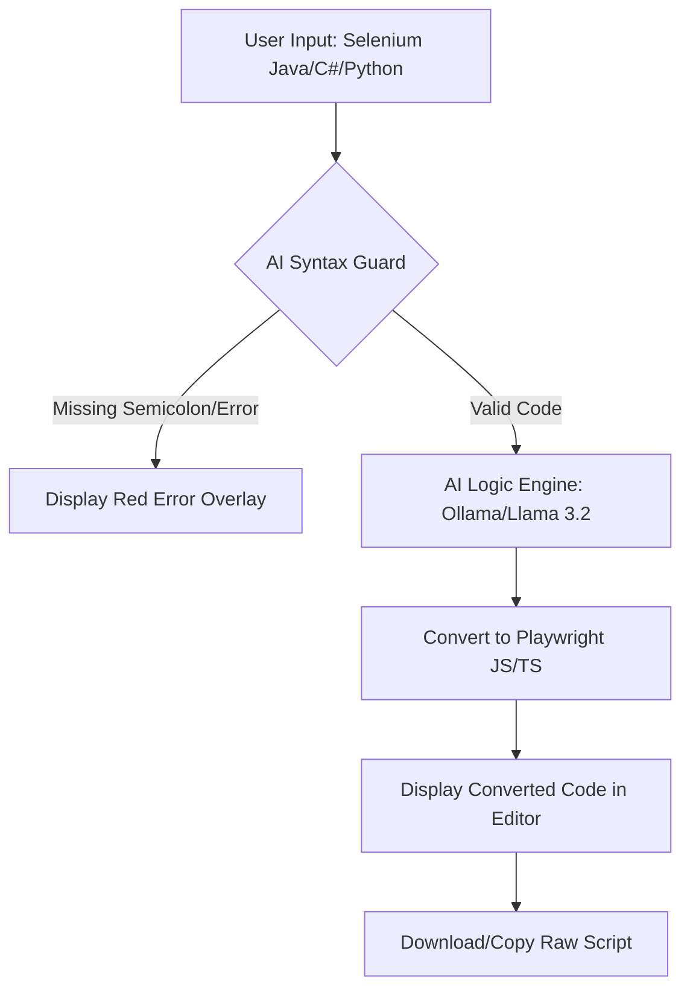

# AI Universal Script Converter - Technical Documentation

## 🔄 System Flow Graph


## Overview
A Tier-1 premium web application designed to migrate legacy automation scripts (Selenium Java, C#, Python, etc.) to modern Playwright JavaScript/TypeScript using local LLM orchestration (Ollama).

## Architecture (A.N.T. Protocol)
- **Layer 1: Architecture (`architecture/`)**: Defined logic for TestNG mapping and syntax validation rules.
- **Layer 2: Navigation (`index.html`)**: The core UI that handles user interaction and routes logic to the LLM.
- **Layer 3: Tools (`tools/`)**: PowerShell automation scripts for CLI-based conversion.

## Features
- **Universal Input**: Supports Selenium (Java, Python, C#), Puppeteer, and standard JS tests.
- **Strict Syntax Safety**: AI-driven validation detects missing semicolons and unclosed braces before conversion.
- **Local LLM**: Powered by `llama3.2` via Ollama for privacy and speed.
- **Premium UI**: Glassmorphism design, animated backgrounds, and real-time status tracking.

## Deployment & Setup
1. **Ollama Setup**:
   - Install Ollama from [ollama.ai](https://ollama.com).
   - Pull the model: `ollama pull llama3.2`.
   - **CRITICAL**: Run Ollama with CORS enabled for browser communication:
     ```powershell
     $env:OLLAMA_ORIGINS="*"; ollama serve
     ```
2. **Usage**:
   - Open `index.html` in any modern browser.
   - Paste source code and click **Convert Now**.

## Maintenance
- Updates to conversion logic should be refined in the `system` prompt within `index.html`.
- New versions of models can be swapped by changing the `model` property in the fetch request.
